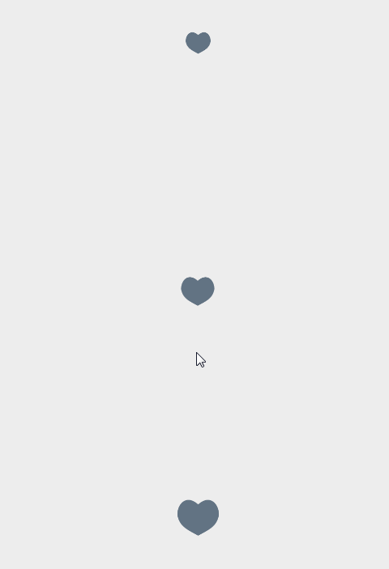

## LikeView

自定义点赞View，仿Twitter点赞，加入了两种取消点赞动画（心碎效果\旋转缩小效果）





use Gradle:

```
repositories {
  maven { url "https://jitpack.io" }
  mavenCentral()
  google()
}
dependencies {
    implementation 'com.github.czh235285:LikeView:1.0.1'
}
```
in xml :

```

    <czh.library.LikeView
        android:id="@+id/lv"
        android:layout_width="wrap_content"
        android:layout_height="wrap_content"
        android:layout_centerInParent="true"
        app:checkedColor="#DE383D"
        app:cirRadius="20dp"
        app:defaultColor="#627383"
        app:durationTime="600"
        app:unlike_style="BROKEN" />
		
```


## Attributes

|name|format|description|
|:---:|:---:|:---:|
| cirRadius | dimension | 半径
| checkedColor | color | 选中颜色
| defaultColor | color | 未选中颜色
| durationTime | integer |设置动画时间
| unlike_style | enum |设置取消点赞动画 常规(NORMAL)或心桃碎裂(BROKEN)或旋转缩小至消失(SHRINK)